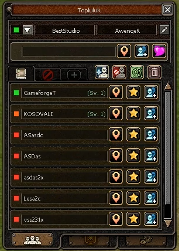

# Official Community System (Messenger Renewal)

Resmi Metin2 **Topluluk** penceresinin birebir uyarlaması. Eski messenger yerine tek pencerede arkadaş, engel, istek, lonca ve ayar sekmeleri.



**Video:** [YouTube — Kurulum & Demo](https://youtu.be/SJXmSuoCfCA)

---

## Ne var?

- Topluluk penceresi (`uicommunity.py` + `communitywindow.py`)
- Arkadaş / Engelle / İstek alt sekmeleri, aksiyon butonları (ekle, engelle, fısıltı, sil)
- Durum mesajı, bağlantı durumu (online / meşgul / offline vb.)
- İsim üzerine gelince hizalama (derece + sıralama puanı)
- Lonca sekmesi — üye listesi, konum, fısıltı *(opsiyonel flag)*
- Ayarlar sekmesi — gizlilik / bildirim seçenekleri
- Client binary + game server paketleri, `PythonCommunity` modülü
- UI `.sub` dosyaları dahil

## Paket yapısı

```
01. Svn/          → Client & Game source (patch dosyaları)
02. Client/       → root, uiscript, ymir work assetleri
03. Server/       → MySQL (player.status_message vb.)
```

## Flagler

**Client** (`Locale_inc.h`):
- `ENABLE_MESSENGER_RENEWAL`
- `ENABLE_COMMUNITY_GUILD_RENEWAL` *(lonca sekmesi için)*

**Game** (`service.h`):
- `__MESSENGER_RENEWAL__`
- `__COMMUNITY_GUILD_RENEWAL__`

Client ve game tarafında ikisi de açık olmalı; sadece client açıkken paket uyumsuzluğu olur.

## Kurulum (kısaca)

1. `01. Svn` dosyalarını kendi source ağacına uygula (merge / diff).
2. `02. Client` içeriğini pack ve `d:/ymir work/ui/game/windows/` altına kopyala.
3. `03. Server/mysql` SQL dosyasını çalıştır.
4. Client + game rebuild, pack güncelle.

## Notlar

- Eski `uimessenger` penceresi bu sistemle değiştirilir; `interfacemodule.py` ve `game.py` patchleri gerekli.
- Locale satırları kendi `locale_interface.txt` dosyana eklenmeli (pakette yoksa).
- Fork farklıysa paket opcode / struct sıralamasını kontrol et.

---

## İletişim

Sorular için Discord'dan yazabilirsin.

| | |
|---|---|
| GitHub | [github.com/ybeststudio](https://github.com/ybeststudio) |
| Discord | [discord.gg/NXmc6JrwYr](https://discord.gg/NXmc6JrwYr) |
| Discord ID | `beststudio` |
| Web | [beststudio.dev](https://beststudio.dev) |
| TurkMMO | [Best Studio](https://forum.turkmmo.com/uye/2104546-best-studio/) |
| YouTube | [@ybeststudio](https://www.youtube.com/@ybeststudiostr) |
| Instagram | [@ybeststudio](https://www.instagram.com/ybeststudio) |
| Facebook | [ybeststudio](https://www.facebook.com/ybeststudio/) |
| Twitter | [@ybeststudio](https://twitter.com/ybeststudio) |
| TikTok | [@ybeststudio](https://tiktok.com/@ybeststudio) |

---

**Best Studio** — Metin2 private server çözümleri
